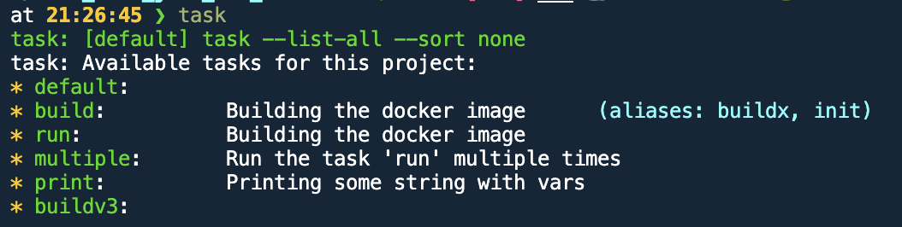
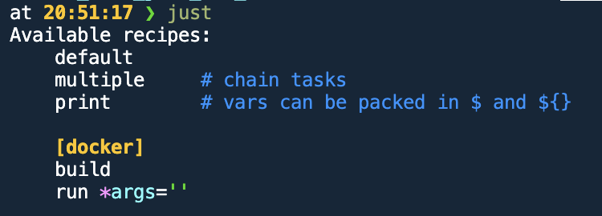
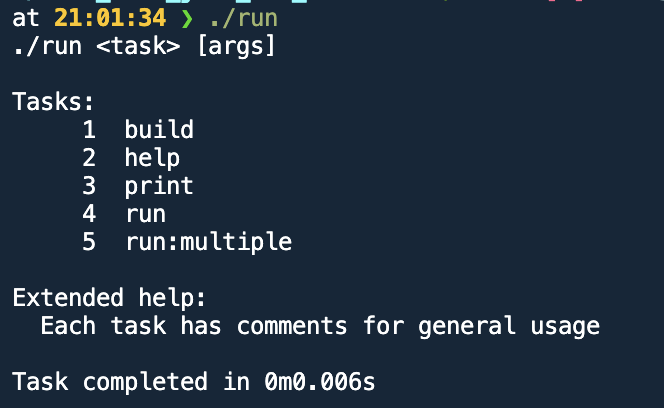
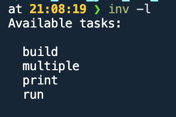

# Beyond the Makefile

## Introduction

In the realm of automating repetitive tasks and managing project workflows, several tools have emerged to simplify and streamline these processes. Among the most notable are [Makefile](https://www.gnu.org/software/make/manual/make.html), [Taskfile](https://taskfile.dev/), [Just](https://github.com/casey/just), [invoke](https://www.pyinvoke.org/index.html) and a custom Bash scripts ([run](https://www.youtube.com/watch?v=SdmYd5hJISM&t=42s)). Each of these tools offers unique features and benefits, catering to different needs and preferences of developers.

For each of the tools, you obviously need to have the tool installed on your system. Makefile is a standard tool on Unix-based systems, while Taskfile, Just, and invoke need to be installed separately. The installation process for each tool may vary depending on the platform and package manager used.

## Choices
### Makefile
[Makefile](https://www.gnu.org/software/make/manual/make.html)

Makefile is a build automation tool that has been around since the early days of Unix. It uses a file named `Makefile` to define a set of tasks to be executed. These tasks are typically used to compile and link programs, but Makefile can be used for a wide range of automation tasks. The syntax of Makefile is simple yet powerful, allowing for complex dependency management and task execution.

**Commands**
```
make build
make run
make multiple
make print
make VAR1='yo yo' print
```

### Task
[Taskfile](https://taskfile.dev/)

Taskfile is a modern alternative to Makefile, designed to be simpler and more intuitive. It uses a YAML-based configuration file named `Taskfile.yml` to define tasks. Taskfile aims to provide a more user-friendly experience while maintaining the power and flexibility needed for complex workflows. It supports features like task dependencies, variables, and cross-platform compatibility. But also some fancy features like the ability to restrict recipes to certain OSes and/or architectures, continously watching a task with an interval and have preconditions for a task.

It also supports a global Taskfile.yml file that can be used to define tasks that are shared across multiple projects or system wide tasks.



**Commands**
```bash
task  # list all tasks
task build
task run
task run -- echo hello blaat
task multiple
task print
task VAR1='yo yo' print
```

### Just
[Just](https://github.com/casey/just)

Just is another modern task runner that focuses on simplicity and ease of use. It uses a file named `Justfile` to define tasks, with a syntax that is inspired by Makefile but more concise and readable. Just is designed to be easy to install and use, with a focus on providing a pleasant user experience. It supports features like variables, dependencies, and command-line arguments.



**Commands**
```bash
just  # list all tasks
just build
just run
just run echo hello blaat
just multiple
just print
VAR1='yo yo' just print
```


### run - a bash script
[run](https://www.youtube.com/watch?v=SdmYd5hJISM&t=42s)

For those who prefer a more hands-on approach, writing custom Bash scripts is a viable option. Bash scripts offer complete control over the automation process, allowing developers to write scripts tailored to their specific needs. While this approach requires more effort and expertise, it provides unmatched flexibility and customization. Bash scripts can be used to automate virtually any task that can be performed from the command line.

In summary, whether you choose Makefile, Taskfile, Just, or a custom Bash script, each tool offers unique advantages that can help streamline your development workflow and automate repetitive tasks.

Write an introduction of Makefile and the newer alternatives taskfile, just and a self created bash script.



**Commands**
```bash
./run  # list all tasks
./run build
./run run
./run run 'echo hello blaat'
./run multiple
./run print
# VAR1='yo yo' ./run print # doesn't work
```

### invoke
[invoke](https://www.pyinvoke.org/index.html)

Invoke is a Python-based task execution tool that is designed to be simple, flexible, and powerful. It uses a file named `tasks.py` to define tasks, with a syntax that is easy to read and write. Invoke is built on top of the Python programming language, making it easy to extend and customize. It supports features like task dependencies, command-line arguments, and parallel execution.

**Commands**
```bash
inv -l # list all tasks
inv build
inv run
inv run --extra='echo hello world'
inv multiple
inv print
VAR1='yo yo' inv print
```



#### Dependencies
Python needs to be installed on the system of course as well as the `invoke` library and the `python-dotenv` for reading the .env file.

```bash
python3 -m venv .venv
source .venv/bin/activate[.fish]
pip install -U pip
pip install -r requirements.txt
```

Or using `uv`:
```bash
uv venv
uv pip install -r requirements.txt
```

## The same features
All of the tools are able to execute the same commands. The difference is in the syntax and the way the commands are defined. Makefile uses a Makefile, Taskfile uses a Taskfile.yml, Just uses a Justfile, invoke uses a tasks.py file and a bash script uses a .sh (or run in this case) file.

### Specifics

#### Makefile
- Standard tool on Unix-based systems
- Simple syntax
- Easily getting started from scratch
- Needs make to be installed
- Probably easy to use in pipeline, since most environments have make installed
- Need to open the Makefile to read the recipes
- Doesn't provide a way to pass arguments to the recipes without defining a variable for it in advance

#### Just
- Simpeler than Makefile
- Easy to get started
- Easier than Makefile with more features
- Needs to be installed, single binary
- Probably needs to be installed in the pipeline
- Autocomplete the commands
- Easy to see the recipes, with the default recipe

#### Task
- Modern alternative to Makefile
- YAML-based configuration
- Very easy to read and write
- Needs to be installed, single binary
- More verbose than the others
- Probably needs to be installed in the pipeline
- Autocomplete the commands
- Easy to see the recipes, with the default recipe
- Ability to restrict recipes to certain OSes and/or architectures
- Abilty to continously watch a task with an interval, which runs only when the source changes
- Ability to have preconditions for a task
- [Integrations](https://taskfile.dev/integrations/) in editors like VSCode

#### Bash script
- Full control over the automation process
- More effort and expertise required
- No dependencies
- bash is installed on every system
- Will run in every pipeline
- Easy to see the recipes, with the default recipe

#### Invoke
- Python-based
- Easy to read and write (if you know Python)
- More powerful and flexible than the others
- More dependencies
- Python is probably installed on the system
- Dependencies probably needs to be installed in the pipeline
- Easy to see the recipes, by running `inv -l`

## Conclusion

In conclusion, each of the tools has its own strengths and weaknesses, and the best choice depends on the specific needs and preferences of the developer. Makefile is a classic tool that is widely used and supported, while Task, Just, and Invoke offer modern alternatives with more user-friendly syntax and additional features. For those who prefer a more hands-on approach, writing custom Bash scripts and using invoke provides complete control and flexibility. Ultimately, the choice of tool comes down to personal preference and the requirements of the project. Regardless of which tool you choose, automating repetitive tasks and managing project workflows can help improve productivity and reduce errors in your development process.

I suggest to use the Task. It has superpowers compared to the rest, while not having to program it yourself. The most important part is its readability, where even the most novice "developer" can understand what is happening. The small side affect of its readability is its verboseness, where a bit more typing is required. Though it pays of, when seeing the output of the `task --list` command.